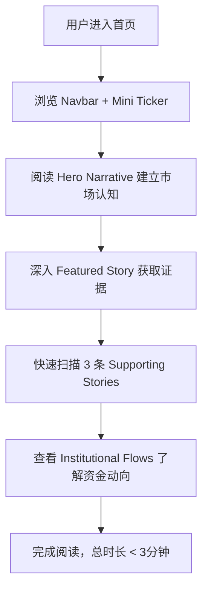

## 1. 产品概述
一个帮助用户在三分钟内看懂今日美股市场走向的 AI 金融资讯平台。聚焦当日最核心的市场叙事（Narrative），以极简克制的信息层级呈现关键资讯，面向美股投资者、宏观交易者及 AI 板块关注者。
- 核心问题：海量金融信息过载，用户难以快速抓住市场主线
- 产品价值：用一条 Hero Narrative 统领全页，让用户在极短时间内建立对当日市场的清晰认知

## 2. 核心功能

### 2.1 功能模块
1. **首页**：唯一页面，按叙事层级纵向排列所有内容，用户滚动即可在 3 分钟内浏览完全部关键信息

### 2.2 页面详情
| 页面名称 | 模块名称 | 功能描述 |
|---------|---------|---------|
| 首页 | Navbar | 品牌标识 + Story 入口，极简设计 |
| 首页 | Mini Market Ticker | 精简行情条，仅展示 S&P 500 / Nasdaq / Dow 三大指数涨跌幅 |
| 首页 | Hero Narrative | 当日最核心市场主线，一句话概括 + 大标题排版，占据首屏视觉重心 |
| 首页 | Featured Story | 围绕 Hero Narrative 展开的深度故事，包含标题、摘要、关键引用证据 |
| 首页 | Supporting Stories (×3) | 三条支撑性故事，每条含标题与简短摘要，篇幅克制 |
| 首页 | Institutional Flows (×2) | 机构资金流向摘要，呈现大资金动向 |

## 3. 信息层级
| 层级 | 模块 | 说明 |
|-----|------|------|
| Primary | Hero Narrative | 页面唯一主导叙事，字体最大、视觉权重最高 |
| Secondary | Featured Story | 直接支撑 Hero 的深度内容 |
| Tertiary | Supporting Stories ×3 | 补充视角，信息密度逐级降低 |
| Low Priority | Institutional Flows ×2 | 辅助参考数据 |

## 4. 核心流程

## 5. 用户界面设计
### 5.1 设计风格
- **主色调**：纯白背景 `#FFFFFF`，黑色文字 `#1A1A1A`，灰色辅助 `#6B7280`
- **强调色**：极克制使用，红/绿仅用于涨跌标识
- **字体**：英文标题使用 Georgia 或类似衬线体体现编辑感，正文使用系统原生字体栈
- **布局风格**：单列纵向叙事流，大量留白，间距以 8px 倍数递进
- **参考风格**：Bloomberg 编辑版式、WSJ 杂志感、Apple Editorial 留白美学、Linear 克制交互
- **避免**：Crypto 赌博风、七彩渐变、Dashboard 堆叠感、信息过载、多 Narrative 并存

### 5.2 页面设计概览
| 页面名称 | 模块名称 | UI 元素 |
|---------|---------|--------|
| 首页 | Navbar | 固定顶部，白底 + 底部 1px 分割线，品牌 Logo 左对齐 |
| 首页 | Mini Market Ticker | 窄条横排，三指数并排，涨绿跌红，字号克制 |
| 首页 | Hero Narrative | 大标题 36-48px，衬线字体，居中对齐，充分上下留白 |
| 首页 | Featured Story | 标题 + 摘要 + 引用块，左对齐，与 Hero 形成视觉节奏变化 |
| 首页 | Supporting Stories | 3 列或纵向排列，每条标题 + 一行摘要，信息密度低 |
| 首页 | Institutional Flows | 2 列数据卡片，简洁标签 + 数值 |

### 5.3 首页约束
- 不允许过多 ticker（仅 3 个指数）
- 不允许过多 stories（严格 1 Featured + 3 Supporting）
- 不允许重复数据
- 不允许多个 narrative 同时存在（每页仅 1 个 Hero Narrative）
- 不允许 dashboard 堆叠感

### 5.4 响应式
- 桌面端优先（Desktop-first）
- 断点：≥1024px 桌面、768-1023px 平板、<768px 移动端
- 移动端故事卡片改为单列纵向排列
