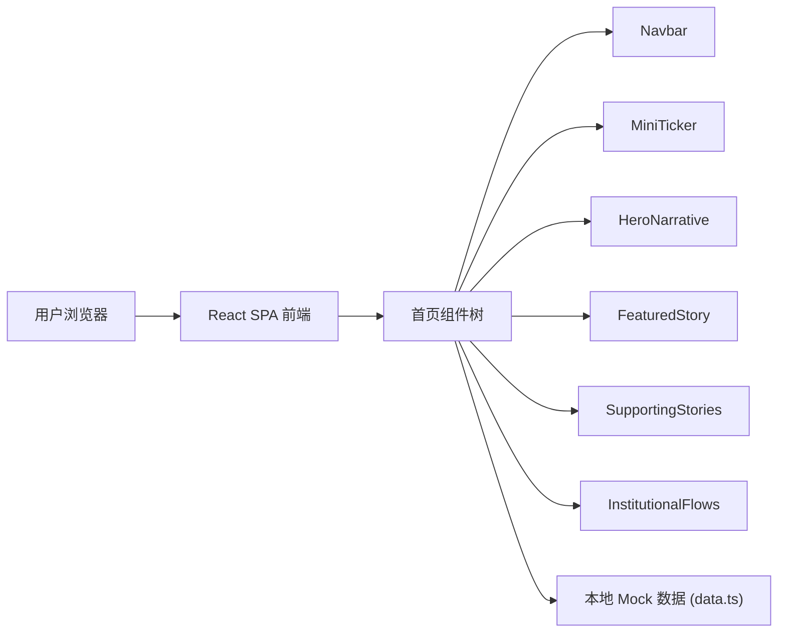

## 1. 架构设计


## 2. 技术说明
- 前端：React@18 + TypeScript + Tailwind CSS@3 + Vite
- 初始化工具：vite-init
- 状态管理：Zustand
- 图标库：lucide-react
- 路由：react-router-dom（单页面应用，仅首页路由 `/`）
- 数据：本地 mock data，通过 `src/data/marketData.ts` 提供
- 部署形态：纯静态 SPA，Vite 构建后可直接部署

## 3. 路由定义
| 路由 | 用途 |
|-------|---------|
| / | 首页，包含全部叙事层级内容 |

## 4. 数据定义
```ts
interface IndexData {
  name: string;
  symbol: string;
  value: number;
  change: number;
  changePercent: number;
}

interface Narrative {
  id: string;
  category: string;
  headline: string;
  summary: string;
  timestamp: string;
}

interface FeaturedStory {
  id: string;
  title: string;
  summary: string;
  keyQuote: string;
  quoteSource: string;
  readTime: string;
}

interface SupportingStory {
  id: string;
  title: string;
  summary: string;
  source: string;
}

interface InstitutionalFlow {
  id: string;
  label: string;
  description: string;
  value: string;
  direction: "inflow" | "outflow";
}

interface MarketData {
  date: string;
  indices: IndexData[];
  heroNarrative: Narrative;
  featuredStory: FeaturedStory;
  supportingStories: SupportingStory[];
  institutionalFlows: InstitutionalFlow[];
}
```

## 5. 组件树
```
App
├── Navbar
│   ├── BrandLogo
│   └── NavLinks
├── MiniTicker
│   └── TickerItem (×3)
├── HeroNarrative
│   ├── CategoryBadge
│   └── NarrativeHeadline
├── FeaturedStory
│   ├── StoryTitle
│   ├── StorySummary
│   └── KeyQuote
├── SupportingStories
│   └── StoryCard (×3)
└── InstitutionalFlows
    └── FlowCard (×2)
```

## 6. 视觉与体验约束
- 纯白背景 + 黑色文字，仅红/绿用于涨跌
- 标题使用 Georgia 衬线字体，正文使用系统字体栈
- 大量留白，间距以 8px 倍数递进
- 禁止七彩渐变、Dashboard 堆叠感、信息过载
- 桌面端优先，向下适配平板和移动端
- 滚动时各区块可添加入场淡入动画，保持克制
